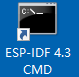

# Dingtian Relay Development Board demo source code
This Demo source for [Dingtian Relay Development Board](https://www.dingtian-tech.com/en_us/product.html?tab=relay)
## Demo Source
- Ethernet
- WiFi AP
- WiFi Station
- GPIO
- CAN bus
- RS485 bus
- HTTP Server
- MQTT
- RTC(PCF8563) and NTP(only 16ch and 32ch)
- Wiegand(only 16ch and 32ch)

## Supported Dingtian devices
- Dingtian Relay  2 Channel DT-R002
- Dingtian Relay  4 Channel DT-R004
- Dingtian Relay  8 Channel DT-R008
- Dingtian Relay 16 Channel DT-R016
- Dingtian Relay 32 Channel DT-R032

## Dingtian Relay Development Board order from
- [Dingtian Aliexpress Store](https://www.aliexpress.com/item/4000999069820.html)
- [Dingtian Aliexpress Official Store](https://www.aliexpress.com/item/2255801046476492.html)
- [Dingtian Alibaba Store](https://dingtiantech.en.alibaba.com/)

## step 1: install ESP-IDF
- Espressif DOC [ESP-IDF Get Started](https://docs.espressif.com/projects/esp-idf/en/v4.3.3/esp32/get-started/index.html)
shows how to install ESP-IDF
- this demo base on [ESP-IDF V4.3.1](https://github.com/espressif/esp-idf/tree/v4.3.1)

## step 2: patch dingtian code for ESP-IDF
- folder "esp-idf-dt-patch" is dingtian patch for ESP-IDF
- please copy "esp-idf-dt-patch/components" to ESP-IDF "components"
- if you ESP-IDF is not V4.3.1,you need modify "esp_eth_phy.h" and "CMakeLists.txt" by manual

## step 3: install esp-link drivers
folder "esp_link_driver" have three driver
- CH34X_linux
- CH34X_MAC
- CH34X_windows

## step 4: open "ESP-IDF 4.3 CMD"


## step 5: clone demo source code
```
git clone https://github.com/dtlzp/relay-dev-demo.git relay-dev-demo
```

## step 6: update demo source code
```
cd relay-dev-demo
git pull
```

## step 7: compile 16ch "gpio" demo example
- "make.bat" default COM port is "COM17",you need change to you COM port
- edit "common/channel.h" for 16ch
```
//#define DT_2CH  1
//#define DT_4CH  1
//#define DT_8CH  1
#define DT_16CH 1
//#define DT_32CH 1
```
- compile "gpio" demo
```
cd relay-dev-demo
cd gpio
make.bat a
make.bat fm
```
